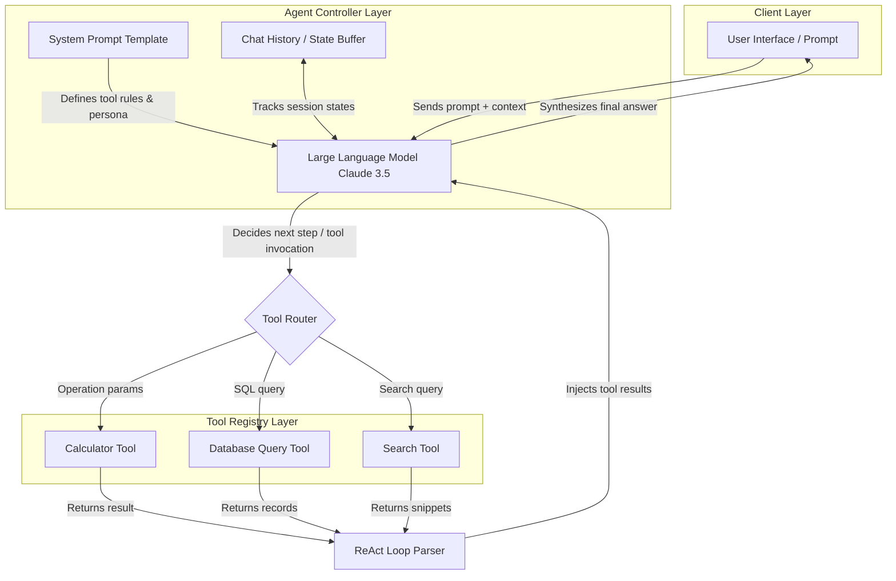

Chatbots are helpful, but **AI agents** are the true future of conversational interfaces. Unlike basic chatbots that simply reply to prompts statically, an agent can think, decide which tools to use, and execute tasks dynamically to achieve a goal.

In this developer guide, we will build a custom conversational AI chat agent from scratch using Node.js, LangChain, and Anthropic's Claude API.

---

## Understanding AI Agent Architecture

Unlike static APIs or simple chatbots, an AI Agent behaves dynamically. To understand how the system functions under the hood, let us inspect the comprehensive component architecture:



### The Runtime Lifecycle: How It Works

When Srijay writes a prompt like *"What is 1548 multiplied by 87?"*, the application executes a series of coordinated steps:

1. **Prompt Ingestion:** The client sends the query alongside the **System Prompt** which explicitly tells the LLM: *"You have a tool called calculator. If a calculation is requested, do not solve it yourself. Instead, return a tool call payload with the parameters."*
2. **Tool Routing Decision:** The LLM evaluates the query. Seeing a mathematical query, it outputs a structured **tool call** object (containing the tool name `calculator` and arguments `{operation: "multiply", num1: 1548, num2: 87}`) rather than plain text.
3. **Execution & Observation:** The Javascript runtime catches this tool call, halts LLM stream, runs the native calculator function, and returns the result `134676` as a system observation.
4. **Final Synthesis:** The LLM receives the history of the conversation, the tool call it requested, and the tool observation. It synthesizes this into the final human-readable message: *"1548 multiplied by 87 is 134,676."*

---

## Step 1: Initialize Your Project

Create a new directory, initialize your Node.js application, and install the required dependencies:

```bash
mkdir custom-ai-agent
cd custom-ai-agent
npm init -y
npm install @langchain/anthropic @langchain/core dotenv
```

Create a `.env` file in the root directory to store your API credentials:

```env
ANTHROPIC_API_KEY=your_actual_anthropic_api_key_here
```

---

## Step 2: Define Agent Tools

Tools are JavaScript functions that the agent can choose to execute. Let's build a calculator tool. LangChain provides structure for these using schemas, which are passed to the LLM so it knows *when* and *how* to call the tool:

```javascript
// tools.js
const { DynamicStructuredTool } = require("@langchain/core/tools");
const { z } = require("zod");

const calculatorTool = new DynamicStructuredTool({
  name: "calculator",
  description: "Perform basic arithmetic calculations (add, subtract, multiply, divide).",
  schema: z.object({
    operation: z.enum(["add", "subtract", "multiply", "divide"]),
    num1: z.number().describe("First number to process"),
    num2: z.number().describe("Second number to process"),
  }),
  func: async ({ operation, num1, num2 }) => {
    switch (operation) {
      case "add": return (num1 + num2).toString();
      case "subtract": return (num1 - num2).toString();
      case "multiply": return (num1 * num2).toString();
      case "divide": return num2 !== 0 ? (num1 / num2).toString() : "Error: Division by zero";
      default: return "Error: Unknown operation";
    }
  },
});

module.exports = { calculatorTool };
```

---

## Step 3: Implement the ReAct Loop

Now, connect the Anthropic model to our tools and implement the agent executor loop. This file handles the reasoning engine and feeds observations back to the AI:

```javascript
// agent.js
require("dotenv").config();
const { ChatAnthropic } = require("@langchain/anthropic");
const { calculatorTool } = require("./tools");

const model = new ChatAnthropic({
  modelName: "claude-3-5-sonnet-20241022",
  temperature: 0,
});

// Bind tools directly to model parameters
const modelWithTools = model.bindTools([calculatorTool]);

async function runAgent(userInput) {
  console.log(`User Query: ${userInput}\n`);
  
  // Call model with initial user query
  let response = await modelWithTools.invoke(userInput);
  
  // Check if model wants to call a tool
  if (response.tool_calls && response.tool_calls.length > 0) {
    const toolCall = response.tool_calls[0];
    console.log(`[Agent Action] invoking tool: ${toolCall.name} with args:`, toolCall.args);
    
    // Execute calculator tool
    const toolResult = await calculatorTool.invoke(toolCall.args);
    console.log(`[Tool Observation] Result: ${toolResult}\n`);
    
    // Provide observation back to the model for final synthesis
    const finalResponse = await model.invoke([
      { role: "user", content: userInput },
      response,
      { role: "tool", content: toolResult, tool_call_id: toolCall.id }
    ]);
    
    console.log(`[Agent Final Answer] ${finalResponse.content}`);
  } else {
    console.log(`[Agent Final Answer] ${response.content}`);
  }
}

runAgent("What is 1548 multiplied by 87?");
```

---

> [!IMPORTANT]
> AI Agents perform best when given clear system prompts describing their identity, role, and the constraints of the tools they are allowed to use. Always validate tool input parameters locally before execution to prevent security exploits.

