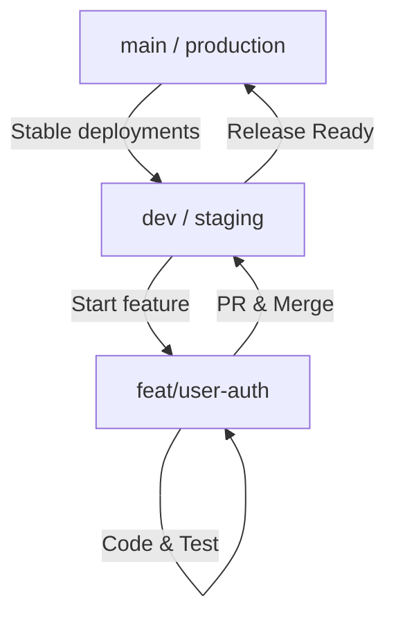

When you work in a team, Git branching strategies like Git Flow or Trunk-Based Development are essential for avoiding conflicts and organizing releases. But when you are a **solo developer**, these systems often feel like bureaucratic overhead.

Does a solo developer really need `develop`, `release`, `hotfix`, and `feature` branches? 

Probably not. But pushing directly to `main` is also a recipe for disaster—it leaves you without a stable branch to deploy from, makes rollbacks difficult, and complicates testing. Here is the ultimate middle-ground strategy.

## The Solo-Dev Git Flow: "Feature Branch Light"

Instead of complex hierarchies, we use just **two** long-lived branch concepts, plus temporary task branches:



1. **`main`**: Represents production-ready code. Nothing gets committed here directly unless it's a critical production emergency.
2. **`dev`**: The working integration branch. This is where features are combined and tested before launch.
3. **`feat/*`**: Temporary feature branches created from `dev`.

### Why Use Feature Branches If You Are Alone?

It is tempting to code everything on `dev`. However, feature branches provide a massive mental advantage: **Context Isolation**. 

If you are halfway through implementing a complex database migration, and you suddenly spot a bug in your CSS, feature branches allow you to stash/commit your work, switch back to `dev`, fix the bug, deploy it, and return to your migration without breaking anything.

## Command Walkthrough

Here is how a typical feature lifecycle looks:

```bash
# 1. Start from dev and get latest updates
git checkout dev
git pull origin dev

# 2. Create and switch to feature branch
git checkout -b feat/stripe-integration

# 3. Work and commit locally
git add .
git commit -m "feat: implement stripe webhook handler"

# 4. Merge back to dev
git checkout dev
git merge feat/stripe-integration --no-ff
```

> [!NOTE]
> The `--no-ff` (no fast-forward) flag forces Git to create a merge commit. This keeps your commit history grouped cleanly under feature flags, making it easy to revert an entire feature later if it breaks.

## Conclusion

By adopting this lightweight strategy, you keep your commit history clean, ensure your deployments remain stable, and build good development habits that will scale effortlessly if you ever bring partners or contributors onto the project.
